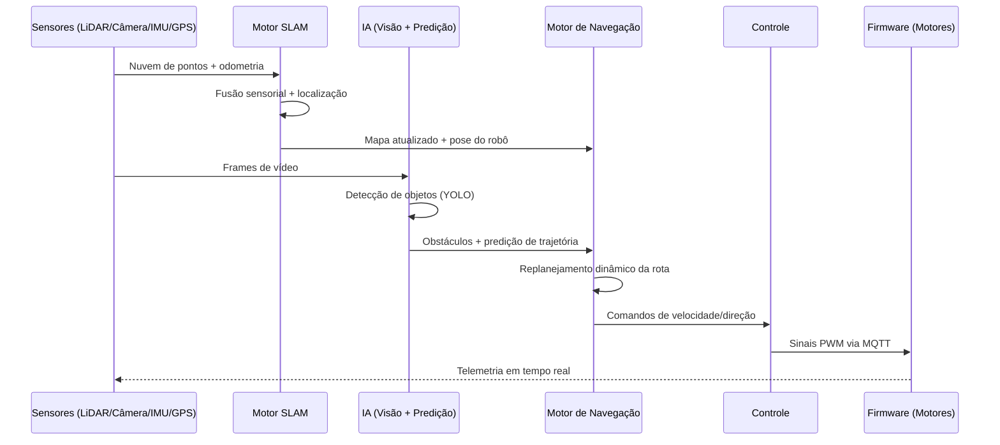
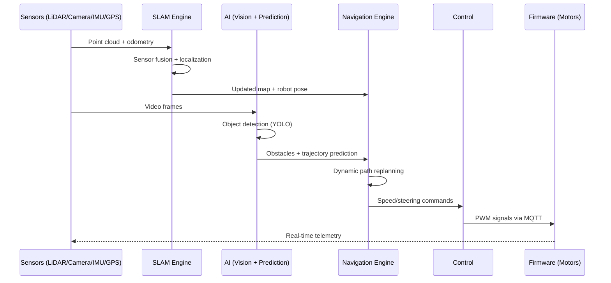

<div align="center">

# 🤖 Autonomous Navigation System
### SLAM-Based Real-Time Path Planning & Obstacle Avoidance for Mobile Robots

[](#)
[](#)
[](#)
[](#)
[](#)
[](#)
[](#)

**[🇧🇷 Português](#-pt-br) | [🇺🇸 English](#-en)**

</div>

---

<a name="-pt-br"></a>
# 🇧🇷 PT-BR

## 📖 Visão Geral

Este projeto é um **sistema completo de navegação autônoma** para robôs móveis, construído sobre uma arquitetura de **SLAM (Simultaneous Localization and Mapping)** própria, com **desvio de obstáculos em tempo real**, **planejamento dinâmico de trajetória** e **fusão sensorial multimodal** (LiDAR, câmera, IMU e GPS).

O sistema foi projetado do zero para operar em ambientes dinâmicos e não estruturados, combinando percepção computacional (visão + detecção de objetos), inteligência de decisão (planejamento e predição de trajetória) e controle embarcado de baixa latência (firmware dedicado), tudo orquestrado por um backend robusto com comunicação em tempo real via WebSocket.

É uma stack full-stack de robótica de ponta a ponta: **firmware → ROS2 → IA/SLAM → backend → frontend web → app mobile**.

---

## 🏗️ Arquitetura do Sistema

```mermaid
flowchart TB
    subgraph HW["🔌 Hardware / Firmware (ESP32)"]
        F1[Encoders]
        F2[IMU]
        F3[GPS]
        F4[Bateria]
        F5[Motor Driver]
        F6[MQTT Client]
        F7[OTA Manager]
        F8[Segurança / Criptografia]
    end

    subgraph SENS["📡 Camada de Sensores"]
        S1[LiDAR]
        S2[Câmera]
        S3[IMU]
        S4[GPS]
        S5[Sensor Manager]
    end

    subgraph ROS["🧩 ROS2 Nodes"]
        R1[camera_node]
        R2[lidar_node]
        R3[sensor_node]
        R4[navigation_node]
        R5[control_node]
        R6[robot_bringup]
        R7[robot_visualization / RViz]
        R8[simulation / Gazebo]
    end

    subgraph SLAM["🗺️ SLAM Engine"]
        SL1[Sensor Fusion]
        SL2[Localization]
        SL3[Mapping]
        SL4[SLAM Core]
    end

    subgraph AI["🧠 Inteligência Artificial"]
        A1[Vision Processor / YOLO]
        A2[Object Detection]
        A3[Path Intelligence]
        A4[Path Optimizer]
        A5[Prediction Engine]
        A6[Decision Engine]
        A7[Planner]
    end

    subgraph NAV["🧭 Navegação"]
        N1[Path Planner]
        N2[Obstacle Avoidance]
        N3[Navigation Engine]
        N4[Controller]
    end

    subgraph CORE["⚙️ Core do Sistema"]
        C1[Autonomous System]
        C2[Mission Manager]
        C3[Robot State]
        C4[Telemetry Manager]
    end

    subgraph BACK["🖥️ Backend (FastAPI)"]
        B1[Routers: robots / missions / control / telemetry]
        B2[WebSocket Manager]
        B3[Auth / JWT / Permissions]
        B4[Command Service]
        B5[(Database)]
    end

    subgraph CLIENT["💻 Interfaces"]
        W1[Frontend Web - React + Vite]
        M1[App Mobile - Flutter]
    end

    HW -- MQTT / Serial --> SENS
    SENS --> ROS
    ROS --> SLAM
    ROS --> AI
    SLAM --> NAV
    AI --> NAV
    NAV --> CORE
    CORE --> BACK
    BACK <-- WebSocket / REST --> CLIENT
    BACK -- Comandos --> HW
```



### Pipeline de Percepção → Decisão → Ação



---

## ✨ Principais Funcionalidades

- 🗺️ **SLAM em tempo real** — localização e mapeamento simultâneos com fusão de múltiplos sensores (LiDAR + IMU + GPS + odometria visual).
- 🚧 **Desvio de obstáculos dinâmico** — detecção e reação a obstáculos móveis e estáticos com replanejamento instantâneo de rota.
- 🧠 **Planejamento inteligente de trajetória** — otimização de caminho considerando custo energético, distância e segurança.
- 👁️ **Visão computacional embarcada** — detecção de objetos baseada em YOLO integrada via nó ROS2 dedicado.
- 📡 **Telemetria em tempo real** — streaming contínuo de estado do robô via WebSocket para dashboard web e app mobile.
- 🔐 **Segurança de ponta a ponta** — autenticação JWT, controle de permissões no backend e criptografia no firmware.
- 🔄 **Atualizações OTA** — atualização remota de firmware sem necessidade de acesso físico ao robô.
- 🖥️ **Painel de controle web** — dashboard React para monitoramento e envio de missões.
- 📱 **Aplicativo mobile** — controle e acompanhamento do robô em campo via Flutter.
- 🧪 **Simulação integrada** — ambiente de testes completo em Gazebo/ROS2 antes do deploy físico.

---

## 🧰 Stack Tecnológica

| Camada | Tecnologias |
|---|---|
| **Firmware** | C++, PlatformIO, ESP32, MQTT |
| **Middleware Robótico** | ROS2 (Humble), Gazebo |
| **IA / Percepção** | Python, YOLO, OpenCV, modelos de predição de trajetória |
| **SLAM** | Fusão sensorial (LiDAR + IMU + GPS), mapeamento probabilístico |
| **Backend** | FastAPI, WebSockets, JWT, arquitetura orientada a serviços |
| **Frontend Web** | React, TypeScript, Vite |
| **Mobile** | Flutter / Dart |
| **Infraestrutura** | Docker, Docker Compose |

---

## 📁 Estrutura do Projeto

```
├── ai/                  # Percepção, decisão, predição e planejamento
├── backend/             # API FastAPI, WebSocket, segurança, serviços
├── core/                # Núcleo do sistema autônomo (missões, telemetria)
├── docker/              # Dockerfiles e orquestração
├── firmware/            # Firmware embarcado (ESP32)
├── frontend/            # Dashboard web (React + Vite)
├── mobile/              # App mobile (Flutter)
├── navigation/          # Motor de navegação e desvio de obstáculos
├── ros2/                # Pacotes ROS2 (nós, simulação, bringup)
├── sensors/             # Drivers e leitura de sensores
├── slam/                # Motor de SLAM (localização, mapa, fusão)
├── tests/                # Testes automatizados
└── vision/              # Visão computacional e publicação ROS2
```

---

## 🚀 Como Rodar

```bash
# Clonar o repositório
git clone <seu-repositorio>
cd <seu-repositorio>

# Subir toda a stack (backend, frontend, ROS2) via Docker
docker-compose up --build

# Backend disponível em:
http://localhost:8000

# Frontend disponível em:
http://localhost:5173
```

Para o firmware, abra a pasta `firmware/` no **PlatformIO** e faça o upload para o microcontrolador ESP32.

---

## 🗺️ Roadmap

- [ ] Navegação multi-robô com coordenação distribuída
- [ ] Aprendizado por reforço para otimização de rota
- [ ] Suporte a mapas semânticos (SLAM semântico)
- [ ] Integração com visão estéreo para percepção 3D densa

---

## 📄 Licença

Distribuído sob a licença MIT. Veja `LICENSE` para mais detalhes.

---
---

<a name="-en"></a>
# 🇺🇸 EN

## 📖 Overview

This project is a **full autonomous navigation system** for mobile robots, built on a custom **SLAM (Simultaneous Localization and Mapping)** architecture, with **real-time obstacle avoidance**, **dynamic trajectory planning**, and **multimodal sensor fusion** (LiDAR, camera, IMU, and GPS).

The system was designed from the ground up to operate in dynamic, unstructured environments, combining computer perception (vision + object detection), decision intelligence (path planning and trajectory prediction), and low-latency embedded control (dedicated firmware) — all orchestrated by a robust backend with real-time WebSocket communication.

It's a full end-to-end robotics stack: **firmware → ROS2 → AI/SLAM → backend → web dashboard → mobile app**.

---

## 🏗️ System Architecture

```mermaid
flowchart TB
    subgraph HW["🔌 Hardware / Firmware (ESP32)"]
        F1[Encoders]
        F2[IMU]
        F3[GPS]
        F4[Battery]
        F5[Motor Driver]
        F6[MQTT Client]
        F7[OTA Manager]
        F8[Security / Encryption]
    end

    subgraph SENS["📡 Sensor Layer"]
        S1[LiDAR]
        S2[Camera]
        S3[IMU]
        S4[GPS]
        S5[Sensor Manager]
    end

    subgraph ROS["🧩 ROS2 Nodes"]
        R1[camera_node]
        R2[lidar_node]
        R3[sensor_node]
        R4[navigation_node]
        R5[control_node]
        R6[robot_bringup]
        R7[robot_visualization / RViz]
        R8[simulation / Gazebo]
    end

    subgraph SLAM["🗺️ SLAM Engine"]
        SL1[Sensor Fusion]
        SL2[Localization]
        SL3[Mapping]
        SL4[SLAM Core]
    end

    subgraph AI["🧠 Artificial Intelligence"]
        A1[Vision Processor / YOLO]
        A2[Object Detection]
        A3[Path Intelligence]
        A4[Path Optimizer]
        A5[Prediction Engine]
        A6[Decision Engine]
        A7[Planner]
    end

    subgraph NAV["🧭 Navigation"]
        N1[Path Planner]
        N2[Obstacle Avoidance]
        N3[Navigation Engine]
        N4[Controller]
    end

    subgraph CORE["⚙️ System Core"]
        C1[Autonomous System]
        C2[Mission Manager]
        C3[Robot State]
        C4[Telemetry Manager]
    end

    subgraph BACK["🖥️ Backend (FastAPI)"]
        B1[Routers: robots / missions / control / telemetry]
        B2[WebSocket Manager]
        B3[Auth / JWT / Permissions]
        B4[Command Service]
        B5[(Database)]
    end

    subgraph CLIENT["💻 Client Interfaces"]
        W1[Web Dashboard - React + Vite]
        M1[Mobile App - Flutter]
    end

    HW -- MQTT / Serial --> SENS
    SENS --> ROS
    ROS --> SLAM
    ROS --> AI
    SLAM --> NAV
    AI --> NAV
    NAV --> CORE
    CORE --> BACK
    BACK <-- WebSocket / REST --> CLIENT
    BACK -- Commands --> HW
```



### Perception → Decision → Action Pipeline



---

## ✨ Key Features

- 🗺️ **Real-time SLAM** — simultaneous localization and mapping with multi-sensor fusion (LiDAR + IMU + GPS + visual odometry).
- 🚧 **Dynamic obstacle avoidance** — detection and reaction to moving and static obstacles with instant path replanning.
- 🧠 **Intelligent trajectory planning** — path optimization accounting for energy cost, distance, and safety margins.
- 👁️ **Onboard computer vision** — YOLO-based object detection integrated through a dedicated ROS2 node.
- 📡 **Real-time telemetry** — continuous robot state streaming via WebSocket to the web dashboard and mobile app.
- 🔐 **End-to-end security** — JWT authentication, permission control in the backend, and encryption at the firmware level.
- 🔄 **OTA updates** — remote firmware updates without physical access to the robot.
- 🖥️ **Web control panel** — React dashboard for monitoring and mission dispatch.
- 📱 **Mobile app** — field control and monitoring via Flutter.
- 🧪 **Integrated simulation** — full Gazebo/ROS2 test environment before physical deployment.

---

## 🧰 Tech Stack

| Layer | Technologies |
|---|---|
| **Firmware** | C++, PlatformIO, ESP32, MQTT |
| **Robotics Middleware** | ROS2 (Humble), Gazebo |
| **AI / Perception** | Python, YOLO, OpenCV, trajectory prediction models |
| **SLAM** | Sensor fusion (LiDAR + IMU + GPS), probabilistic mapping |
| **Backend** | FastAPI, WebSockets, JWT, service-oriented architecture |
| **Web Frontend** | React, TypeScript, Vite |
| **Mobile** | Flutter / Dart |
| **Infrastructure** | Docker, Docker Compose |

---

## 📁 Project Structure

```
├── ai/                  # Perception, decision, prediction and planning
├── backend/             # FastAPI API, WebSocket, security, services
├── core/                # Autonomous system core (missions, telemetry)
├── docker/              # Dockerfiles and orchestration
├── firmware/            # Embedded firmware (ESP32)
├── frontend/            # Web dashboard (React + Vite)
├── mobile/              # Mobile app (Flutter)
├── navigation/          # Navigation engine and obstacle avoidance
├── ros2/                # ROS2 packages (nodes, simulation, bringup)
├── sensors/             # Sensor drivers and reading
├── slam/                # SLAM engine (localization, map, fusion)
├── tests/                # Automated tests
└── vision/              # Computer vision and ROS2 publishing
```

---

## 🚀 Getting Started

```bash
# Clone the repository
git clone <your-repository>
cd <your-repository>

# Bring up the full stack (backend, frontend, ROS2) via Docker
docker-compose up --build

# Backend available at:
http://localhost:8000

# Frontend available at:
http://localhost:5173
```

For the firmware, open the `firmware/` folder in **PlatformIO** and upload it to the ESP32 microcontroller.

---

## 🗺️ Roadmap

- [ ] Multi-robot navigation with distributed coordination
- [ ] Reinforcement learning for route optimization
- [ ] Semantic map support (semantic SLAM)
- [ ] Stereo vision integration for dense 3D perception

---

## 📄 License

Distributed under the MIT License. See `LICENSE` for more details.
